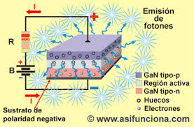
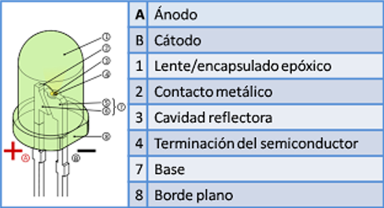
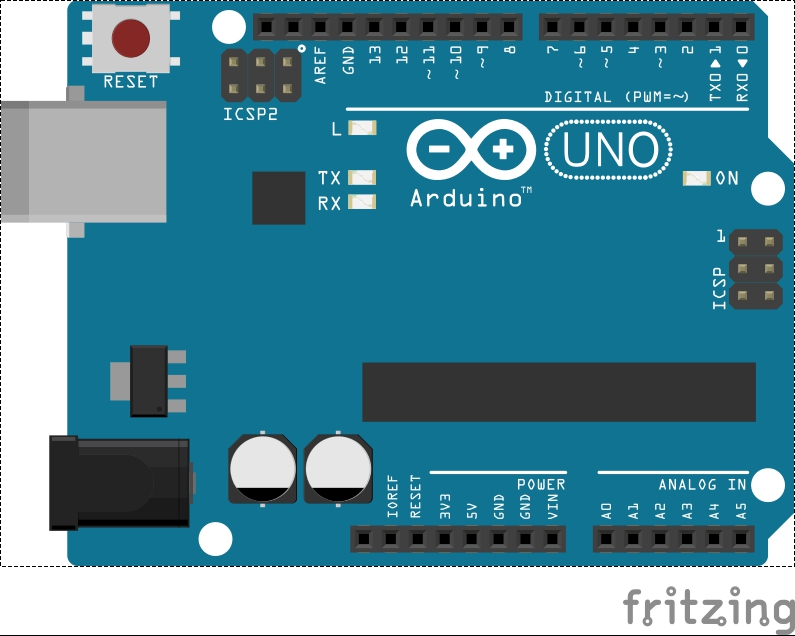

# Resumen LED

El LED es un elemento electrónico semiconductor capaz de emitir luz a partir de la circulación de una corriente directa a traves de él.

A diferencia de la lámpara incandescente que emite luz como resultado del calentamiento de un filamente metálico al circular corriente eléctrica,
la emisión de luz en un LED se explica por un salto de energia (pérdida) cuando un electrón atraviesa una juntura semiconductora.

La pérdida de energía se transforma en fotones que, dependiendo de los materiales semiconductores, tendrá un color o longitud de onda (o rango) específico

## FUNCIONAMIENTO

## CARACTERÍSTICAS

## PRACTICA: Usar el LED incluido en la placa como indicador

DIAGRAMA

PROGRAMA

/*
  Blink
  
  Turns on an LED on for one second, then off for one second, repeatedly.

  Most Arduinos have an on-board LED you can control. On the Uno and
  
  Leonardo, it is attached to digital pin 13. If you're unsure what
  
  pin the on-board LED is connected to on your Arduino model, check
  
  the documentation at http://www.arduino.cc

  This example code is in the public domain.

  modified 8 May 2014
  
  by Scott Fitzgerald
  
 */

// the setup function runs once when you press reset or power the board

void setup() {

  // initialize digital pin 13 as an output.
  
  pinMode(13, OUTPUT);
  
}

// the loop function runs over and over again forever

void loop() {

  digitalWrite(13, HIGH);   // turn the LED on (HIGH is the voltage level)
  
  delay(1000);              // wait for a second
  
  digitalWrite(13, LOW);    // turn the LED off by making the voltage LOW
  
  delay(1000);              // wait for a second
  
}
