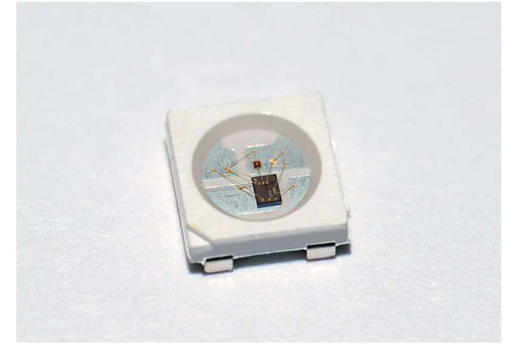
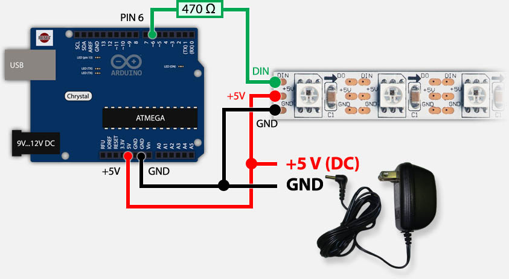

#Resumen LED PROGRAMABLE (INTELIGENTE)

Es un componente electrónico que agrupa, en un mismo encapsulado, a 3 LEDs de color: uno ROJO, uno VERDE y uno AZUL; junto a un circuito integrado controlador de cada uno de los emisores de luz.

Cada componente tiene 6 conexiones al exterior. 4 son comunes y sirven a la alimentación de energía eléctrica (GND o 0Volt y +5V) y otros 2 son usados como entrada de señal de control y salida de señal de control.

Con esta disposición se pueden encadenar un número de elementos en cascada, es decir, uno detrás del otro, formando tiras de elementos de orden de 30, 60 o 120 por metro lineal.

## FUNCIONAMIENTO

Se conecta la alimentación (+5V) a los terminales de potencia y se conecta el terminal DIN del primero a un procesador maestro externo. En nuestro caso un ATMEGA328 (Arduino)

El terminal DOUT del primero se conecta al terminal DIN del siguiente en la cadena (si es el caso) y así sucesivamente hasta el último.

El protocolo de comunicación en el primer terminal DIN es una serie de pulsos de estados "1" y "0" con duraciones especificadas por el fabricante.

Una condición especial de arranque al momento de alimentar los componentes, coloca al controlador integrado en el estado de espera y reposo, con los tres LEDs apagados.

Luego de este estado de RESET al inicio de alimentación, el protocolo contempla una señal de entrada para poner en estado de RESET a los dispositivos pero de manera programada.

El procesador maestro debe programarse siguiendo el protocolo para el controlador integrado de manera que el controlador serializa en el primer DIN y en el tiempo 3 bytes que se corresponden con los niveles de intensidad de cada color.

Con esta técnica, los 3 primeros bytes son tomados como los parámetros de color del primer LED WS2812 de una cadena, retransmitiendo por su terminal DOUT todos los que lleguen despues del tercero, lo que ingresará por el segundo DIN del segundo LED y así sucesivamente.

## CARACTERISTICAS

[Especificación técnica](./WS2812.pdf)

## ALIMENTACIÓN EXTERNA (en caso de mas de 1 elemento)

Con la máxima intensidad de brillo, cada elemento de color consume 50mA (0,05A) cada uno. En la placa Arduino, el terminal de conexión +5V es capaz de proveer no mas de 100mA de manera segura. Es por este motivo que debe analizarse el uso de una fuente externa para la alimentación de mas de 1 LED WS2812.

DIAGRAMA

PROGRAMAS

[Test_1](./WS2812_TEST_V1.ino)

[Test_2](./WS2812_TEST_V2.ino)

