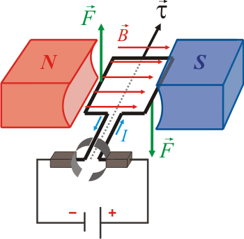
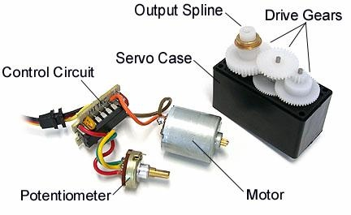
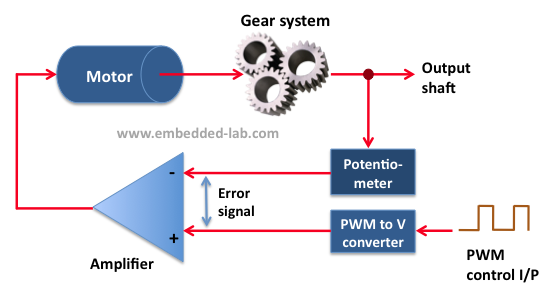

# Resumen SERVOMOTOR

Actuador electromecánico con control electrónico incorporado. Puede mover un eje de tracción rotando en ambos sentidos y con un ángulo o grado de rotación en función de una señal de comando.

## FUNCIONAMIENTO

Su funcionamiento se basa en un motor eléctrico el cual hace girar su eje en función de la intensidad y dirección de una corriente eléctrica que lo alimenta.

El eje del motor se acopla a una serie o cadena de engranajes reductores los cuales permiten reducir la velocidad de rotación, aumentando la fuerza en el eje.

Por otra parte, se conecta solidario a uno de los egranajes un sensor de posición angular el cual provee de información sobre la posición del eje de salida a un circuito de control.

## CARACTERISTICAS

## PRACTICA: Conectar y controlar un Servomotor

DIAGRAMA

PROGRAMA
