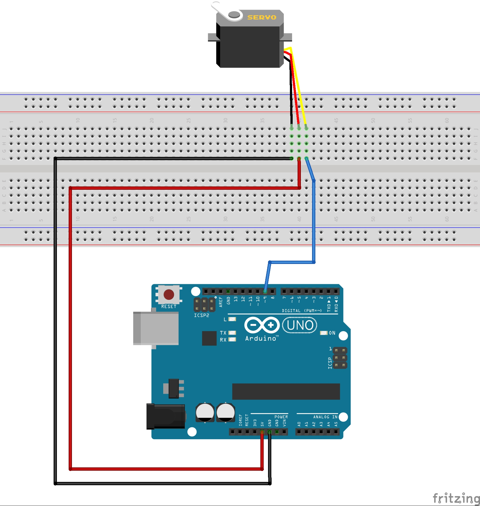

# Resumen SERVOMOTOR

Actuador electromecánico con control electrónico incorporado. Puede mover un eje de tracción rotando en ambos sentidos y con un ángulo o grado de rotación en función de una señal de comando.

## FUNCIONAMIENTO

Su funcionamiento se basa en un motor eléctrico el cual hace girar su eje en función de la intensidad y dirección de una corriente eléctrica que lo alimenta.

Motor eléctrico

El eje del motor se acopla a una serie o cadena de engranajes reductores los cuales permiten reducir la velocidad de rotación, aumentando la fuerza en el eje.

Por otra parte, se conecta solidario a uno de los egranajes un sensor de posición angular el cual provee de información sobre la posición del eje de salida a un circuito de control.

## CARACTERISTICAS

[Especificaciones de Servomotor SG90](SG90Servo.pdf)

## PRACTICA: Conectar y controlar un Servomotor

DIAGRAMA

PROGRAMA

<pre>
/* Sweep
 by BARRAGAN &lt;<u>http://barraganstudio.com</u>&gt;
 This example code is in the public domain.

 modified 8 Nov 2013
 by Scott Fitzgerald
 <u>http://www.arduino.cc/en/Tutorial/Sweep</u>
*/

#include &lt;<b>Servo</b>.h&gt;

<b>Servo</b> myservo; &nbsp;// create servo object to control a servo
// twelve servo objects can be created on most boards

int pos = 0; &nbsp;&nbsp;&nbsp;// variable to store the servo position

void setup() {
 &nbsp;myservo.attach(9); &nbsp;// attaches the servo on pin 9 to the servo object
}

void loop() {
 &nbsp;for (pos = 0; pos &lt;= 180; pos += 1) { // goes from 0 degrees to 180 degrees
 &nbsp;&nbsp;&nbsp;// in steps of 1 degree
 &nbsp;&nbsp;&nbsp;myservo.write(pos); &nbsp;&nbsp;&nbsp;&nbsp;&nbsp;&nbsp;&nbsp;&nbsp;&nbsp;&nbsp;&nbsp;&nbsp;&nbsp;// tell servo to go to position in variable 'pos'
 &nbsp;&nbsp;&nbsp;delay(15); &nbsp;&nbsp;&nbsp;&nbsp;&nbsp;&nbsp;&nbsp;&nbsp;&nbsp;&nbsp;&nbsp;&nbsp;&nbsp;&nbsp;&nbsp;&nbsp;&nbsp;&nbsp;&nbsp;&nbsp;&nbsp;&nbsp;// waits 15ms for the servo to reach the position
 &nbsp;}
 &nbsp;for (pos = 180; pos &gt;= 0; pos -= 1) { // goes from 180 degrees to 0 degrees
 &nbsp;&nbsp;&nbsp;myservo.write(pos); &nbsp;&nbsp;&nbsp;&nbsp;&nbsp;&nbsp;&nbsp;&nbsp;&nbsp;&nbsp;&nbsp;&nbsp;&nbsp;// tell servo to go to position in variable 'pos'
 &nbsp;&nbsp;&nbsp;delay(15); &nbsp;&nbsp;&nbsp;&nbsp;&nbsp;&nbsp;&nbsp;&nbsp;&nbsp;&nbsp;&nbsp;&nbsp;&nbsp;&nbsp;&nbsp;&nbsp;&nbsp;&nbsp;&nbsp;&nbsp;&nbsp;&nbsp;// waits 15ms for the servo to reach the position
 &nbsp;}
}

</pre>
